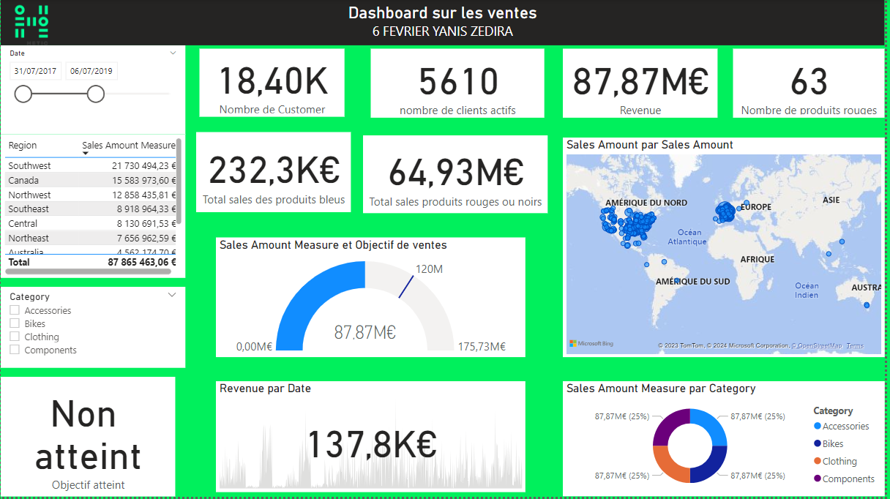

# Portfolio Yanis Zedira

Ce dépôt contient le code de mon portfolio personnel orienté data science et ingénierie des données pour la santé.

## Aperçu

## Technologies

- HTML5 / CSS3
- JavaScript vanilla
- Python, SQL, Power BI, Google Cloud Platform

## Public visé

Les recruteurs et professionnels du domaine médical (Sanofi, Institut Pasteur, AP‑HP...) à la recherche d'un profil data analyst/engineer capable de mettre en place des solutions à impact.

## Utilisation

Ouvrez `index.html` dans votre navigateur ou visitez la page GitHub Pages associée au dépôt. Les projets sont chargés depuis `projects.json` et vous pouvez en ajouter de nouveaux via le formulaire "Ajouter un projet" directement sur la page.

## Badges

